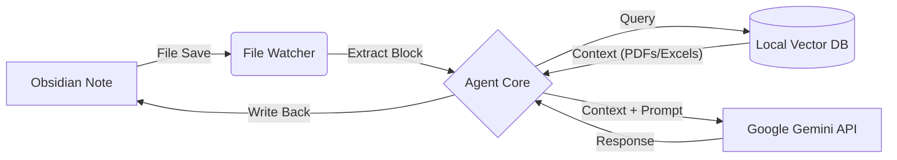

# Lecture Agent 

### The Gemini-Powered FinTech Research Assistant

**Lecture Agent** 是一个专为 FinTech（金融科技）研究生设计的**沉浸式学术辅助系统**。它将 Google Gemini 的推理能力与本地知识库（RAG）深度融合，通过 Obsidian 的非侵入式交互，帮助学生在讲座、研讨会和论文阅读中实时捕捉灵感、验证知识并深度解析术语。

> *"It doesn't replace thinking; it augments your academic curiosity."*

---

##  核心特性 (Key Features)

### 1.  全格式本地知识库 (Multimodal Local RAG)

不再需要手动翻阅数百个课件。Agent 支持对以下格式进行**向量化索引**与**语义检索**：

* **PDF / PPTX / DOCX**: 自动提取并清洗文本。
* **Excel 全系支持**: 完美支持 `.xlsx`、`.xlsm`（安全模式）及 `.xlsb`（二进制大数据），自动将金融数据表转换为 Markdown 格式供 AI 理解。
* **隐私优先**: 核心知识库存储在本地 `ChromaDB`，仅在必要时调用云端推理。

### 2. ️ "UI-less" 极简交互

摒弃复杂的聊天窗口。直接在你的 **Obsidian** 笔记中打字即可触发：

* 输入 `<ai>` 标签包裹你的笔记片段。
* **后台守护进程**会自动检测、思考、并将深度解析**流式回写**到你的笔记中。

### 3.  学术级术语解析 (Deep Term Analysis)

针对 FinTech 领域的严谨性，Agent 遵循独创的 **"Origin-App-Expand"** 解析范式：

* **Origin (溯源)**: 追溯概念的数学定义或历史渊源（如 Black-Scholes 的物理热传导方程背景）。
* **Application (应用)**: 在当前量化交易、DeFi 或风控中的实际用例。
* **Expansion (拓展)**: 关联最新的顶会论文或监管政策（HKMA/PBOC）。

### 4.  跨平台硬件自适应 (Hardware Agnostic)

* **PC Workstation**: 利用 NVIDIA CUDA 加速，秒级构建向量索引。
* **MacBook Pro (Intel/M-Series)**: 针对内存受限环境深度优化，支持 CPU 量化推理，确保在 8GB 内存的老设备上也能稳定运行。

---

##  系统架构 (Architecture)

Lecture Agent 采用松耦合的 **"Observer Pattern" (观察者模式)**：



---

##  快速开始 (Quick Start)

### 1. 环境准备

确保已安装 Python 3.10+ 及 Conda。

```bash
# 克隆仓库
git clone https://github.com/kendrickl1675/Lecture-Agent.git
cd Lecture-Agent

# 安装依赖 (推荐使用 uv 加速)
pip install uv
uv pip install -r requirements.lock

```

### 2. 构建知识库 (Index Your Knowledge)

将教授的课件（PDF, PPT, Excel）放入 Obsidian下的`attachments` 文件夹。

```bash
# 这一步会将非结构化数据转化为向量数据库
python indexer_pro.py

```

### 3. 启动守护进程 (Start the Daemon)

```bash
# 保持终端开启，它会静默运行
python lecture_agent_daemon.py

```

### 4. 在 Obsidian 中使用

在任意笔记中输入：

```markdown
# My Lecture Notes

<ai>
The professor mentioned that the Black-Litterman model solves the "corner solution" problem in Markowitz optimization by introducing investor views.
</ai>

```

按 `Ctrl+S` (保存)，几秒后，它将自动变为：

```markdown
# My Lecture Notes

> [!NOTE] User Input
> The professor mentioned that the Black-Litterman model solves the "corner solution" problem...

The Black-Litterman model effectively mitigates the issue of extreme portfolio weights (corner solutions) inherent in Mean-Variance Optimization... [More content based on your local PDFs]...

### 🏆 Key Term Analysis
* **Corner Solution**
    * **Origin**: ...
    * **Application**: ...

```

---

## 学术诚信与隐私 (Ethics & Privacy)

我们深知学术环境的特殊性，因此设计遵循以下原则：

1. **辅助而非替代**: Agent 旨在提供背景知识检索和术语解释，**不会**替用户撰写论文或完成作业。
2. **来源透明**: 所有基于 RAG 生成的内容都会尝试标注来源文件（如 `Context: Lecture_03_Risk.pdf`），便于用户回溯验证。
3. **数据安全**: 您的私人笔记（Vault）和课件向量库（Vector DB）完全存储在**本地硬盘**。仅有被 `<ai>` 标签包裹的文本段落会被发送至 Google Gemini API 进行处理。

---

## 贡献与反馈 (Contribution)

本项目由 FinTech 研究生开发，旨在解决高强度课程中的知识管理痛点。

* **Bug Report**: 请提交 Issue。
* **Feature Request**: 欢迎 Pull Request，特别是针对新的金融数据格式解析器的支持。

---

*Powered by Google Gemini & LangChain | Designed for High-Performance Learning* 🚀